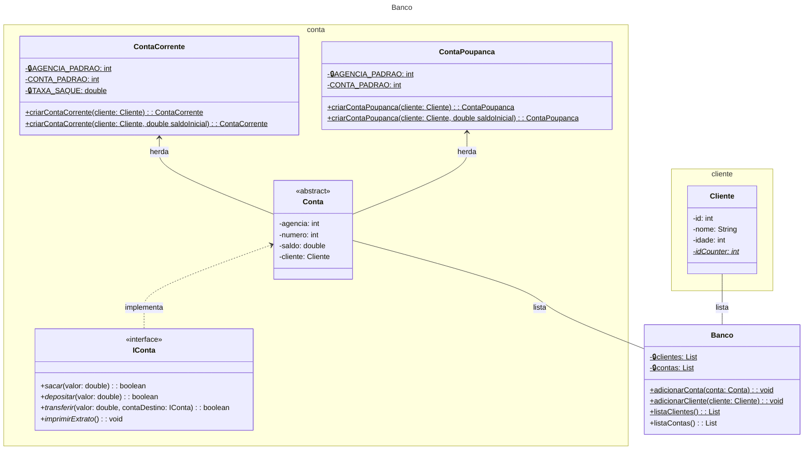

# Desafio: [Criando um Banco Digital com Java e Orientação a Objetos](https://web.dio.me/lab/criando-um-banco-digital-com-java-e-orientacao-objetos/learning/69a2a2a9-ca3c-4cf3-96f7-ca99b08ccf53?back=/track/bradesco-java-cloud-native)

Desafio de POO em Java onde será contas para um cliente de um banco digital,
  com contas poupança e corrente, cada uma com seus métodos de saque, depósito e transferência.  
Desafio proposto no curso *[Bradesco - Java Cloud Native](https://web.dio.me/track/5edf0557-6c91-4aff-86fe-fcd7cb4c4914)*,
da [DIO - Digital Innovation One](https://web.dio.me/).

- O objetivo deste desafio prático é reforçar o conhecimento em Programação Orientada a Objetos (POO) em Java,
  através da implementação de um banco digital.
- Para este projeto foi disponibilizado um repositório no [GitHub](https://github.com/falvojr/lab-banco-digital-oo) com uma implementação de referência.

Neste projeto, existem 6 classes e 1 interface, sendo uma dessas classes a Main, onde testamos as funcionalidades do banco. Para a estrutura do banco, temos:

