# Desafio: [Criando um Banco Digital com Java e Orientação a Objetos](https://web.dio.me/lab/criando-um-banco-digital-com-java-e-orientacao-objetos/learning/69a2a2a9-ca3c-4cf3-96f7-ca99b08ccf53?back=/track/bradesco-java-cloud-native)

Desafio de POO em Java onde será contas para um cliente de um banco digital,
  com contas poupança e corrente, cada uma com seus métodos de saque, depósito e transferência.  
Desafio proposto no curso *[Bradesco - Java Cloud Native](https://web.dio.me/track/5edf0557-6c91-4aff-86fe-fcd7cb4c4914)*,
da [DIO - Digital Innovation One](https://web.dio.me/).

- O objetivo deste desafio prático é reforçar o conhecimento em Programação Orientada a Objetos (POO) em Java,
  através da implementação de um banco digital.
- Para este projeto foi disponibilizado um repositório no [GitHub](https://github.com/falvojr/lab-banco-digital-oo) com uma implementação de referência.

Neste projeto, existem 6 classes e 1 interface, sendo uma dessas classes a Main, onde testamos as funcionalidades do banco. Para a estrutura do banco, temos:

```mermaid
---
title: Banco
---
classDiagram
  namespace cliente{
    class Cliente{
      -id: int
      -nome: String
      -idade: int
      -*idCounter: int*$
    }
  }
  namespace conta {
    class IConta{
      <<interface>>
      +*sacar*(valor: double): boolean
      +*depositar*(valor: double): boolean
      +*transferir*(valor: double, contaDestino: IConta): boolean
      +*imprimirExtrato*(): void
    }
    class Conta{
      <<abstract>>
      -agencia: int
      -numero: int
      -saldo: double
      -cliente: Cliente
    }
    class ContaCorrente{
      -🔒AGENCIA_PADRAO: int$
      -CONTA_PADRAO: int$
      -🔒TAXA_SAQUE: double$
      +criarContaCorrente(cliente: Cliente): ContaCorrente$
      +criarContaCorrente(cliente: Cliente, double saldoInicial): ContaCorrente$
    }
    class ContaPoupanca{
      -🔒AGENCIA_PADRAO: int$
      -CONTA_PADRAO: int$
      +criarContaPoupanca(cliente: Cliente): ContaPoupanca$
      +criarContaPoupanca(cliente: Cliente, double saldoInicial): ContaPoupanca$
    }
  }
  class Banco{
    -🔒clientes: List<Cliente>$
    -🔒contas: List<Conta>$
    +adicionarConta(conta: Conta): void$
    +adicionarCliente(cliente: Cliente): void$
    +listaClientes(): List<Cliente>$
    +listaContas(): List<Conta>
  }
  Conta <.. IConta: implementa
  ContaCorrente <-- Conta: herda
  ContaPoupanca <-- Conta: herda
  Conta -- Banco: lista
  Cliente -- Banco: lista
```

